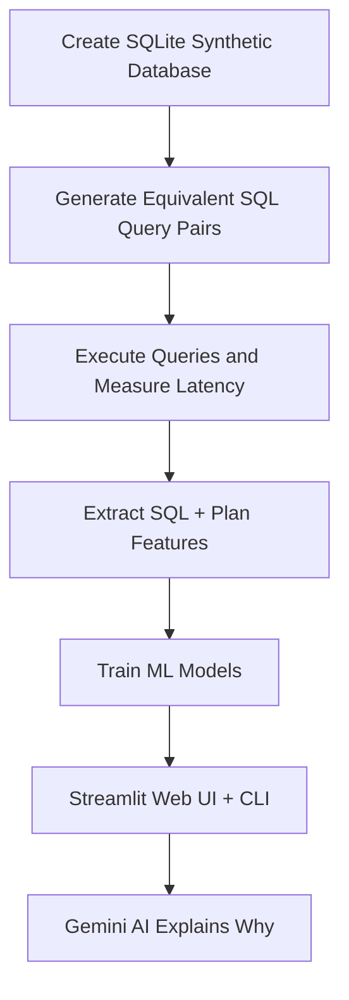

# 📌 **QueryComparatorAI — ML + GenAI System for SQL Query Performance Prediction**

**QueryComparatorAI** is a machine learning system powered by **GenAI** that predicts **which version of two semantically equivalent SQL queries will execute faster**. It automatically:

- Generates SQL query pairs (e.g., `IN` vs `EXISTS`, `JOIN` vs subquery)
- Executes them on a synthetic SQLite database
- Collects latencies + EXPLAIN QUERY PLAN
- Extracts structural & plan-based features
- Trains ML models to predict latency and choose the faster variant
- Provides a **Streamlit Web UI** and **CLI tool** to compare two SQL queries
- Uses **Google Gemini AI** to generate natural-language explanations of why one query is faster

This project blends **Databases**, **Systems**, **Machine Learning**, and **Generative AI** — ideal for research and performance optimization.

---

# 🚀 **Why This Project?**

SQL performance highly depends on *how* the query is written:

| Query Variant | Performance Effect |
|--------------|-------------------|
| `IN` vs `EXISTS` | Big difference on large datasets |
| `JOIN` vs subquery | Optimizer may not fully rewrite |
| Indexed vs non-indexed ORDER BY | Huge latency gap |
| Aggregation functions (`COUNT(*)` vs `COUNT(col)`) | Varies by engine |

Even small query differences can have large performance impacts.

**QueryComparatorAI learns these patterns automatically and explains them using GenAI.**

---

# 🧠 **Architecture Overview**



---

# 🗂️ **Project Structure**

```
query-comparator-ai/
├── data/
│   ├── synth.db                  # Synthetic SQLite database (~12 MB)
│   ├── timings.csv               # Query execution timings (800 rows)
│   ├── query_pairs.txt           # Generated query pairs
│   ├── features_individual.csv   # Per-query features (800 rows)
│   └── features_pairs.csv        # Pairwise diff features (400 rows)
├── src/
│   ├── create_db.py              # Step 1: Create synthetic database
│   ├── generate_queries.py       # Step 2: Generate SQL query pairs
│   ├── run_queries.py            # Step 3: Benchmark queries
│   ├── extract_features.py       # Step 4: Extract features
│   ├── train_model.py            # Step 5: Train ML models
│   └── predict_cli.py            # CLI prediction tool
├── notebooks/
│   └── 01_eda_and_model.ipynb    # EDA and model exploration
├── models/
│   ├── regressor.joblib          # Latency prediction model
│   └── pairwise_clf.joblib       # Pairwise classification model
├── streamlit_app.py              # Streamlit Web UI with Gemini AI
├── requirements.txt
└── README.md
```

---

# 🛠️ **Installation & Setup**

### ✅ **1. Clone the project**

```bash
git clone https://github.com/vir-pareek/query-comparator-ai
cd query-comparator-ai
```

### ✅ **2. Create and activate virtual environment**

```bash
python3 -m venv .venv
source .venv/bin/activate
```

### ✅ **3. Install dependencies**

```bash
pip install -r requirements.txt
```

---

# ✅ **Full Pipeline — How to Run the Project**

### **1. Create synthetic SQLite database**
```bash
python src/create_db.py
```
Creates a database with 4 tables: `users` (20K), `products` (5K), `orders` (100K), `reviews` (80K) + 7 indexes.

### **2. Generate SQL query pairs**
```bash
python src/generate_queries.py
```
Generates 400 pairs across 4 pattern types: `IN vs EXISTS`, `JOIN vs subquery`, `ORDER BY variants`, `COUNT(*) vs COUNT(1)`.

### **3. Execute queries and measure latency**
```bash
python src/run_queries.py
```
Benchmarks each query (1 warmup + 3 runs, median timing) and collects `EXPLAIN QUERY PLAN`.

### **4. Extract structural + plan-based features**
```bash
python src/extract_features.py
```
Extracts 24 features per query: 15 keyword counts + 5 structural metrics + 4 plan-based features.

### **5. Train ML models (Regression + Classification)**
```bash
python src/train_model.py
```

Models will be stored in `models/`.

---

# 🌐 **Streamlit Web App**

Launch the interactive web UI:

```bash
streamlit run streamlit_app.py
```

### Features:
- 🔍 Enter any two SQL queries and compare them
- 📌 View execution plans side-by-side
- ⏱ See predicted latencies
- 🏆 Get the verdict (which query is faster)
- 🧠 **AI-powered explanation** via Google Gemini — explains *why* one query is faster

### Gemini AI Setup:

1. Get a free API key at [aistudio.google.com/apikey](https://aistudio.google.com/apikey)
2. **For local use:** Enter the key in the sidebar
3. **For Streamlit Cloud:** Add it in Settings → Secrets:
   ```toml
   GEMINI_API_KEY = "your-api-key-here"
   ```

> Without an API key, the app falls back to rule-based analysis automatically.

---

# 💡 **Using the Query Comparator CLI**

Compare any two SQL queries:

```bash
python src/predict_cli.py \
"SELECT ... query A ..." \
"SELECT ... query B ..."
```

The CLI prints:

✅ Query A execution plan
✅ Query B execution plan
✅ Predicted latency (log-scale)
✅ **Final verdict: A is faster / B is faster**

Example (IN vs EXISTS):

```bash
python src/predict_cli.py \
"SELECT u.user_id FROM users u WHERE u.country='IN' AND u.user_id IN (SELECT o.user_id FROM orders o WHERE o.status='delivered');" \
"SELECT u.user_id FROM users u WHERE u.country='IN' AND EXISTS (SELECT 1 FROM orders o WHERE o.user_id=u.user_id AND o.status='delivered');"
```

---

# ✅ **Model Performance**

| Task | Metric | Value |
|------|--------|--------|
| Regression (Latency Prediction) | MAE | **0.110 ms** |
| Regression | R² | **0.995** |
| Classification (A faster?) | Accuracy | **91.0%** |
| Classification | F1 Score | **0.911** |

### Top Regression Features:
| Feature | Importance |
|---------|-----------|
| `len_chars` | 0.499 |
| `num_and` | 0.303 |
| `num_equals` | 0.134 |
| `kw_exists` | 0.054 |

### Top Classification Features:
| Feature | Importance |
|---------|-----------|
| `diff_len_chars` | 0.282 |
| `diff_plan_uses_index` | 0.171 |
| `diff_num_parens` | 0.099 |
| `diff_kw_join` | 0.098 |

---

# 🔬 **Key Technical Insights**

- Queries using **INDEX SCAN** tend to be significantly faster.
- `JOIN` is often faster than equivalent **subqueries** in SQLite.
- `EXISTS` outperforms `IN` on large datasets due to **short-circuit evaluation**.
- `ORDER BY` on non-indexed columns is extremely costly.
- More `AND` predicates correlate with higher latency.
- Query length (`len_chars`) is the single strongest predictor of latency.
- Small textual differences produce measurable performance differences.

---

# 📈 **Technologies Used**

- **Python 3** — Core language
- **SQLite** — Database engine
- **Scikit-learn** — Random Forest models (Regression + Classification)
- **Google Gemini AI** — GenAI-powered query explanations
- **Streamlit** — Interactive web UI
- **Pandas / NumPy** — Data handling
- **Matplotlib** — Visualizations
- **Jupyter Notebook** — EDA and experimentation

---

# 🚧 **Limitations**

- Only tested on SQLite
- Plan extraction is simplified (uses `EXPLAIN QUERY PLAN`, not full `EXPLAIN`)
- Synthetic data, not real production workloads
- Feature set is keyword-based (no deep SQL parsing)

---

# 🚀 **Future Improvements**

- PostgreSQL & MySQL support
- Cost-aware optimizer models
- LLM-based SQL embeddings for richer feature representation
- Real workload training with production query logs
- Deep learning models for query plan encoding

---

# 🏁 **Conclusion**

QueryComparatorAI demonstrates how **machine learning + generative AI** can:

✅ Predict SQL query latency with **R² = 0.995**
✅ Identify the faster query variant with **91% accuracy**
✅ Learn from query plans + SQL structure
✅ **Explain performance differences** using Google Gemini AI
✅ Provide practical insights for performance tuning via an interactive web app

A strong blend of **databases**, **systems**, **machine learning**, and **generative AI** — ideal for research and engineering portfolios.